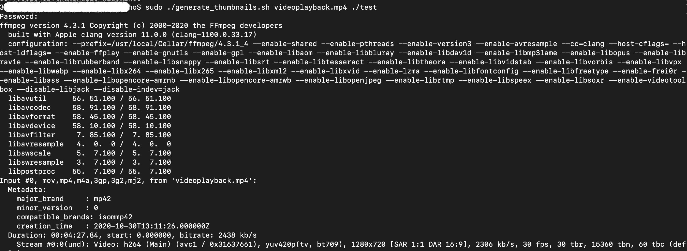
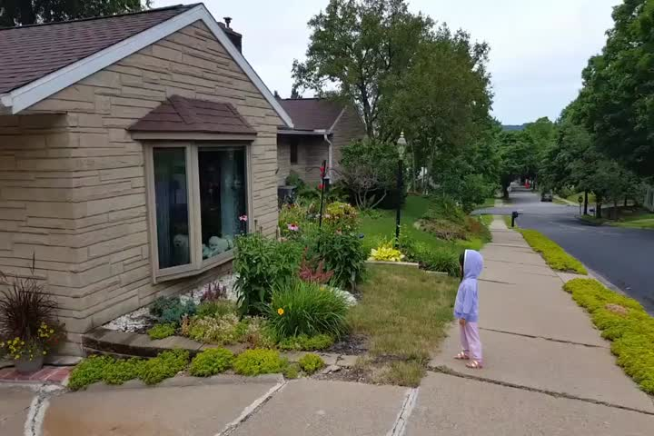
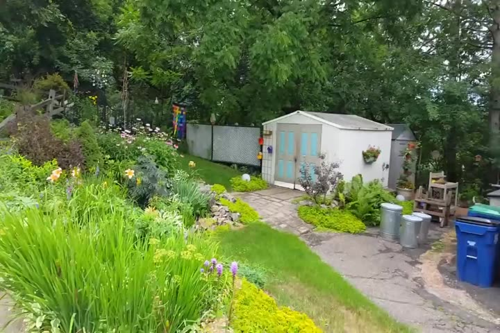
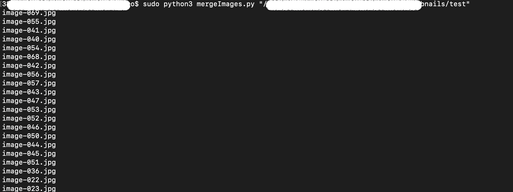
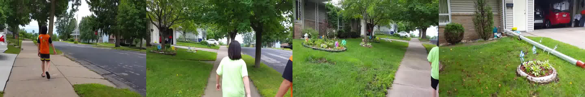
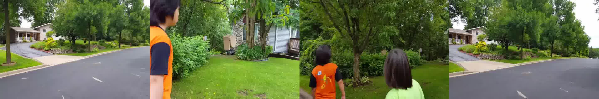
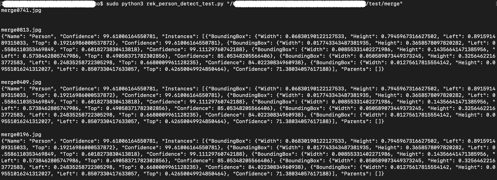

# AWS Rekognition成本优化方案
使用图片拼接降低Rekognition API 调用次数从而优化成本

#### 从视频文件中抽取关键帧并转为图片

sudo ./generate_thumbnails.sh videoplayback.mp4 <THUMBNAILS_PATH>

抽帧图片：

#### 将4张图片横向拼接成一张大图

sudo python3 mergeImages.py "<THUMBNAILS_PATH>"

拼接图例：

#### 将拼接后的大图请求AWS Rekogntion detect_labels API， 可用于人形/人脸/宠物/口罩检测等

sudo python3 rek_person_detect_test.py "<MERGE_PATH>"

